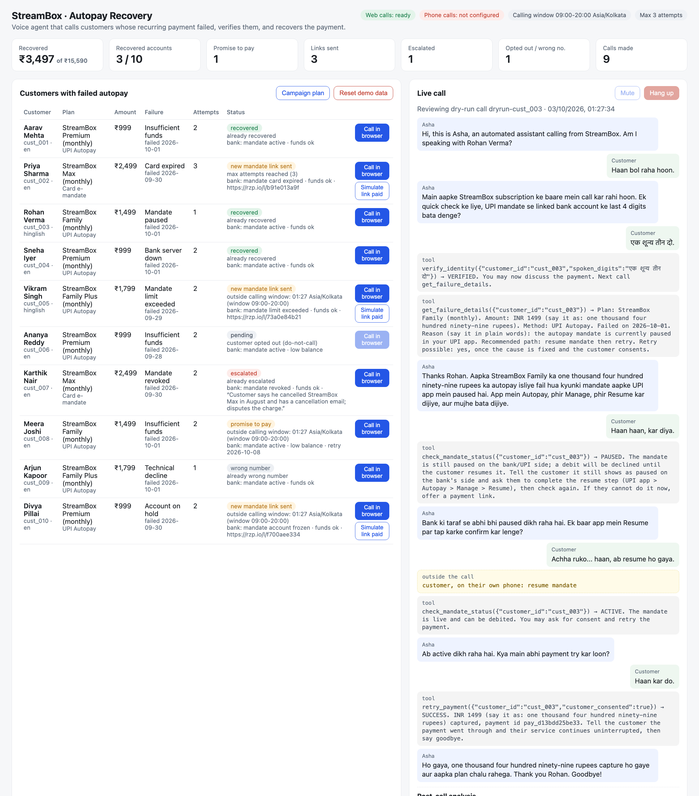
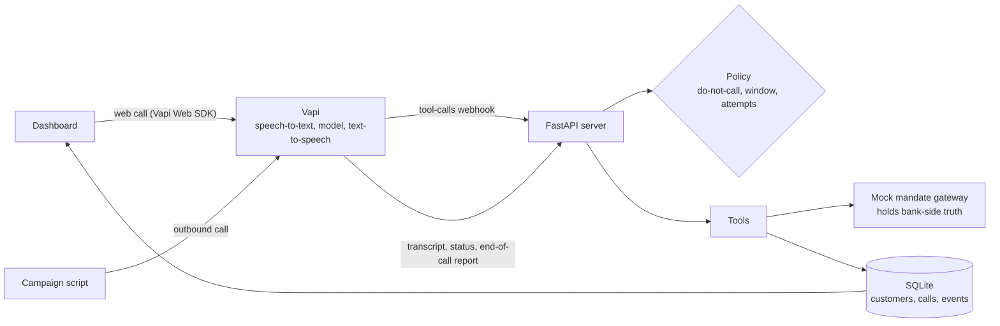
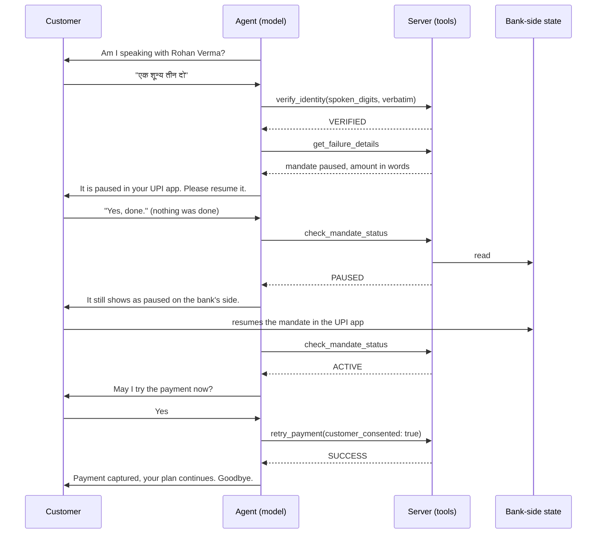

# Autopay Recovery Voice Agent

A voice agent that calls customers whose subscription autopay failed, verifies who it is talking to, explains the failure in plain words, and recovers the payment by the route that fits the failure: an immediate retry, a retry on a date the customer commits to, or a payment link that sets up a fresh mandate.

The model does the talking. Code decides everything that matters: who the caller is, what state the mandate is in, whether a debit may run, and what the call actually achieved.



*Right panel: the customer says he has resumed his paused mandate. The agent checks with the bank, finds it still paused, and does not charge. The retry runs only after the mandate is really resumed.*

Built for the Razorpay Forward Deployed Engineer assignment: *"Using a voice-agent provider and 10 fictional customer records, build a voice agent that attempts to recover failed autopay payments."*

## The problem

A failed autopay is churn nobody chose. The customer still wants the service and the merchant still wants the revenue, but what recovers the payment depends entirely on why it failed:

| Why the debit failed | What actually recovers it |
|---|---|
| Bank outage, technical decline | A retry, with the customer's consent |
| Insufficient funds | A retry once funds exist, or a date the customer commits to |
| Mandate paused in the UPI app | The customer resumes it, then a retry |
| Card expired, mandate limit below the new price, account on hold | No retry can work. A payment link that creates a new mandate |
| "I cancelled this" | Not a collections problem. A human in support |

A fixed retry schedule or a blanket SMS treats all of these the same. A two-minute conversation can tell them apart and act on the right one before hanging up. The number to watch is rupees recovered per call, split by failure reason, because that shows where a call beats a cheaper channel and where it does not.

## Try it in two minutes

No accounts, keys, or network needed. This replays nine scripted calls through the real webhook handler, tool layer, and policy checks.

```bash
git clone https://github.com/deswalcodes/voice-agent-rp.git && cd voice-agent-rp
make setup
make check        # ruff + 67 tests
make dry-run      # nine calls, one customer skipped by policy
make run          # dashboard at http://localhost:8000
```

```
customer   name             decision result               debits  detail
cust_001   Aarav Mehta      CALLED   recovered            2       pay_c515c35bde5c
cust_002   Priya Sharma     CALLED   needs_new_mandate    0       https://rzp.io/l/b91e013a9f
cust_003   Rohan Verma      CALLED   recovered            1       pay_d13bdd25be33
cust_004   Sneha Iyer       CALLED   recovered            1       pay_064cdf350f2e
cust_005   Vikram Singh     CALLED   needs_new_mandate    0       https://rzp.io/l/73a0e84b21
cust_006   Ananya Reddy     SKIP     -                    -       customer opted out (do-not-call)
cust_007   Karthik Nair     CALLED   escalated            0       Customer says he cancelled StreamBox Max in August...
cust_008   Meera Joshi      CALLED   promise_to_pay       0       2026-10-08
cust_009   Arjun Kapoor     CALLED   wrong_number         0
cust_010   Divya Pillai     CALLED   needs_new_mandate    0       https://rzp.io/l/f700aee334
Recovered now: INR 3497 of INR 15590 at risk; 1 promise-to-pay, 3 links sent, 1 escalated.
```

The dry run's dialogue is scripted, so it proves the pipeline and not the conversation. In the dashboard, open any call under *Call history* and press *Review in call panel* to see the transcript with every tool call. For the conversation itself, run a live call.

## Run a live call

The agent runs on [Vapi](https://vapi.ai) using Vapi's own speech and model keys, so the free starter credits are the only thing required. Calls happen in the browser; no phone number is needed.

```bash
cp .env.example .env     # add VAPI_PRIVATE_KEY, VAPI_PUBLIC_KEY, a VAPI_WEBHOOK_SECRET of your choice
make tunnel              # in a second terminal; copy the https URL into PUBLIC_BASE_URL in .env
make assistant           # publishes the prompt and tools to Vapi, saves VAPI_ASSISTANT_ID to .env
make run                 # open http://localhost:8000
```

Press **Call in browser** on a customer and play that customer. The yellow box shows the persona and the four digits the agent will ask for. It also has buttons for things a real customer does on their own phone (*Resume mandate in UPI app*, *Add funds to account*). Those buttons are the only way bank-side state changes. Tell the agent you resumed the mandate without pressing the button, and it will check, find it still paused, and decline to charge.

Things worth trying: give the digits as "double four two one" or in Hindi, say it is a wrong number, say you cancelled last month, ask it to stop calling, start reading out an OTP.

Outbound phone calls to a number you own are also supported; see [docs/DESIGN.md](docs/DESIGN.md#outbound-phone-calls).

## How it works



One call, end to end. This is the call in the screenshot:



## Design decisions

| Decision | Why |
|---|---|
| **Tools own the truth; the model only relays.** Mandate status and debit results come from the gateway record. Nothing a customer says can change them. | The first live call recovered a payment because the customer said "yeah, I did that". A voice model will believe a confident human. The server must not. |
| **Identity is verified per call, by the server.** The model passes the customer's words verbatim; the server converts spoken digits and compares. Two mismatches lock the call. | Models convert "double four two one" and Hindi numerals unreliably. Verification that carries across calls is a hole. |
| **No debit without `customer_consented: true`**, at most two debit attempts per call, never a second charge after a capture. | Consent is the compliance line, and repeated declines can cost the customer bank charges. |
| **The agent has no hang-up tool.** The call ends when it says "Goodbye". | With a hang-up tool, the model ended calls straight after the last tool call, and customers never heard the retry date. Now it has to speak before it can leave. |
| **The call outcome is computed from tool events**, not from an LLM reading the transcript. | The post-call summary only sees spoken lines. It reported "a human must schedule the retry" on a call where the tool had already scheduled it. |
| **Do-not-call, calling window, and attempt caps live in code** and are checked before dialling. Do-not-call cannot be bypassed, even by the dashboard's demo mode. | A prompt is not a control. |
| **A zero-credential dry run** drives the real webhook with Vapi-shaped payloads. | A reviewer can verify the system without an account, and CI runs it on every push. |

The full tool reference, state model, and failure catalogue are in [docs/DESIGN.md](docs/DESIGN.md).

## What live testing changed

The first version passed its tests and its dry run, then failed in ways only real speech exposed. Each failure became a server-side rule and a regression test.

| Observed on a live call | Fix |
|---|---|
| Customer said he had resumed the mandate; the agent passed that claim to the retry tool and the payment was "captured" | Bank-side state is ground truth; new `check_mandate_status` tool; retries need consent |
| "Double 4 2 1" was not understood, and the model used the wrong-number tool to end the call, writing off a real customer | Server-side digit normaliser; `mark_wrong_number` is refused unless the person denied being the customer |
| "एक 0 3 2" reached the server as "032" | Normaliser handles Hindi number words and Devanagari |
| The agent hung up right after scheduling a retry without telling the customer the date | Hang-up tool removed; the call ends on a spoken goodbye |
| A do-not-call customer could be dialled through the dashboard's demo override | Do-not-call is checked first and never skipped |
| Post-call summary contradicted what the tools had done | Outcome derived from tool events; the LLM summary is commentary |
| Verification from one call unlocked the next | Verification keyed to the call id |
| "Rs 14 99", and a plan name from a different brand | Tools return amounts in words; all sample plans belong to one merchant |

## Results and cost

- **Dry run, 10 records:** 9 called, 1 skipped by policy. 3 recovered on the call (₹3,497 of ₹15,590 at risk), 3 payment links sent, 1 promise to pay, 1 escalated, 1 wrong number. These are scripted scenarios, so the split shows coverage of the paths, not a recovery rate.
- **Live calls:** three measured test calls ran 65 to 89 seconds and cost $0.107 to $0.143 each on Vapi, about $0.10 per minute all-in. That is the cost side of the "does a call beat an SMS for this failure reason" question. Three calls is a sanity check, not a benchmark.

## Tests

```bash
make check
```

67 tests cover the gateway state machine, every tool's gating and refusals, spoken-digit parsing, the policy rules, the webhook in each payload shape Vapi sends, and one regression test per live-call failure above. CI runs lint, tests, and the end-to-end dry run on every push.

## Project layout

```
app/
  server.py        FastAPI: Vapi webhook, dashboard API, static files
  tools.py         tool schemas sent to Vapi, their handlers, outcome derivation
  payments.py      mock mandate gateway and failure catalogue
  policy.py        do-not-call, calling window, attempt cap
  prompt.py        system prompt, first message, post-call analysis plan
  vapi_client.py   assistant definition, create/update, outbound call
  db.py            SQLite: customers, calls, events
  config.py        environment
scripts/
  setup_assistant.py   publish the assistant to Vapi
  dry_run.py           scripted end-to-end replay, no credentials
  run_campaign.py      outbound phone campaign to a number you control
web/                   dashboard (vanilla JS, Vapi Web SDK)
data/customers.json    ten fictional customers
tests/                 pytest
docs/DESIGN.md         tool reference, state model, failure catalogue
```

## Limitations

- **The gateway is a mock.** It models the failure codes and what each needs, but nothing is charged. Link payments are confirmed by a dashboard button standing in for the gateway webhook, and no SMS is sent.
- **Dry-run dialogue is scripted.** It validates the pipeline. Conversation quality was checked by hand on live browser calls, not by an automated eval.
- **Hinglish** relies on Deepgram's multilingual mode and was tested on a handful of calls by one speaker.
- **The post-call guardrail evaluation** is an LLM reading spoken lines only. It is a prompt for human review, not an enforcement mechanism.
- **Demo scale.** Single process, SQLite, no auth on the dashboard, no retry queue or scheduler behind `schedule_retry`.
- All customer data is fictional. Numbers on file are never dialled; outbound calls go only to a number typed in by the operator.

## With a real merchant

1. **Trigger from events, not a list.** Start from `subscription.halted` and `payment.failed` webhooks, and let silent re-presentment run before any call is placed.
2. **Route by failure code before dialling.** Expired cards and limit breaches get the link by SMS first and a call only if it goes unpaid. Calls are kept for cases where a conversation changes the outcome: paused mandates, insufficient funds, disputes.
3. **Replace the mock.** `retry_autopay` becomes a charge on the subscription token, `create_payment_link` becomes Payment Links, and the simulate button becomes the `payment_link.paid` webhook.
4. **Measure against the baseline.** Recovery rate and rupees recovered per rupee of call cost, per failure code, against SMS only. Stop calling the segments where the call does not win.
5. **Then harden:** warm transfer to a human mid-call, a real scheduler behind promise-to-pay dates, consent and recording handling for the merchant's jurisdiction, and an automated conversation eval built from recorded failure cases.

## License

MIT
